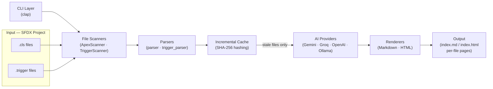
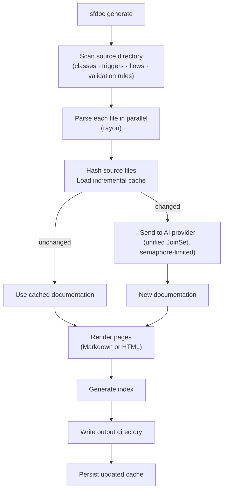

# sfdoc — Salesforce Documentation Generator

`sfdoc` is a Rust CLI tool that turns Salesforce metadata into rich,
AI-generated documentation. It scans your SFDX project, extracts structural
metadata from Apex classes, triggers, Flows, and validation rules, sends that
context to an AI provider, and writes interlinked Markdown or HTML pages that
stay up to date automatically through incremental builds.

---

## Architecture Overview



---

## Project Structure

```
sfdoc/
  Cargo.toml
  src/
    main.rs               # Entry point — CLI dispatch, pipeline orchestration
    cli.rs                # clap CLI definitions (Commands, GenerateArgs, AuthArgs)
    config.rs             # API key storage and resolution (keychain + env var)
    providers.rs          # Provider enum — default models, env vars, base URLs
    scanner.rs            # File discovery (FileScanner trait, ApexScanner, TriggerScanner)
    parser.rs             # Regex-based Apex class structural parser
    trigger_parser.rs     # Apex trigger structural parser
    prompt.rs             # AI prompt construction for Apex classes
    trigger_prompt.rs     # AI prompt construction for Apex triggers
    gemini.rs             # Google Gemini API client
    openai_compat.rs      # OpenAI-compatible client (Groq, OpenAI, Ollama)
    retry.rs              # Exponential backoff with Retry-After header support
    renderer.rs           # Markdown generation and cross-linking
    html_renderer.rs      # Self-contained HTML site generator
    cache.rs              # SHA-256 incremental build cache (.sfdoc-cache.json)
    types.rs              # Shared data structures (ApexFile, ClassMetadata, etc.)
  README.md
  project-plan.md
```

---

## Key Dependencies

| Crate | Purpose |
|-------|---------|
| `clap` (derive) | CLI argument parsing |
| `tokio` | Async runtime for concurrent API calls |
| `reqwest` | HTTP client for AI provider APIs |
| `serde` / `serde_json` | JSON serialization |
| `walkdir` | Recursive directory traversal |
| `rayon` | CPU-parallel file parsing |
| `indicatif` | Terminal progress bars |
| `sha2` | SHA-256 hashing for incremental cache |
| `anyhow` | Ergonomic error handling |
| `regex` | Apex structural parsing |
| `keyring` | OS keychain integration |
| `rpassword` | Masked terminal input for API key entry |

---

## Completed Phases

### Phase 1: Project Scaffolding and CLI ✅

- `Cargo.toml` with all dependencies
- Full module structure established
- `sfdoc generate` subcommand with `--source-dir`, `--output`, `--model`, `--concurrency`, `--verbose`
- API key sourced from environment variable

### Phase 2: File Scanner ✅

- `FileScanner` trait for extensibility across metadata types
- `ApexScanner` implementation using `walkdir`
- Skips `-meta.xml` companion files automatically
- Deterministic sorted output
- `filter_entry` pruning of `.git`, `.sfdx`, `node_modules`, `target`

### Phase 3: Apex Structural Parser ✅

- `OnceLock<Regex>` patterns — compiled once, never in hot loops
- Extracts: class name, access modifier, `abstract`/`virtual`, `extends`, `implements` (including complex generics like `Database.Batchable<SObject>`)
- Extracts method signatures: name, access modifier, return type, parameters, `static` flag
- Extracts properties: name, access modifier, type, `static` flag
- Extracts existing ApexDoc/Javadoc block comments to include in AI context
- Builds a cross-reference list of PascalCase class names (filtering out Apex built-ins)

### Phase 4: AI Client (Gemini) ✅

- Async `reqwest` client against the Gemini `generativelanguage.googleapis.com` API
- `tokio::sync::Semaphore` rate limiting (configurable `--concurrency`)
- Structured prompt: sends full source + extracted metadata + existing ApexDoc comments
- `responseMimeType: application/json` — AI returns JSON directly, no prose scraping
- Parses response into typed `ClassDocumentation` struct

### Phase 5: Markdown Renderer ✅

- One `.md` per class: title, access badges, ToC, description, properties table, method sections with parameter tables, usage examples, See Also cross-links
- `index.md` with alphabetical class listing and one-line summaries
- Cross-linking: scans `relationships` text for known class names, emits relative Markdown links
- `write_output()` creates the output directory and writes all files

### Phase 6: Secure API Key Storage ✅

- `sfdoc auth` subcommand — prompts with masked input via `rpassword`, stores key in OS keychain via `keyring`
- Key is encrypted at rest; never written to disk in plaintext
- Prompts before overwriting an existing key
- `resolve_api_key()` checks environment variable first (CI/CD), then keychain

### Phase 7: Status Command ✅

- `sfdoc status` subcommand — prints version and API key status per provider
- Surfaces whether each key is set via environment variable, keychain, or not configured

### Phase 8: Incremental Builds ✅

- `cache.rs` — SHA-256 hashes each source file before calling the AI
- `.sfdoc-cache.json` persisted in the output directory; maps file paths to `{ hash, model, documentation }`
- Cache is invalidated per file if: source changed, or `--model` changed
- `--force` flag bypasses the cache for a full regeneration
- Separate cache maps for classes and triggers; backward-compatible with old cache files

### Phase 9: Apex Trigger Support ✅

- `TriggerScanner` — discovers `.trigger` files via the same `FileScanner` trait
- `trigger_parser.rs` — parses trigger declaration syntax (`trigger Foo on SObject (events)`)
- `trigger_prompt.rs` — dedicated AI prompt for triggers covering event handlers and handler classes
- Trigger-specific renderer template: event handler table, handler class cross-links, usage notes
- Triggers included in `index.md` / `index.html` alongside classes

### Phase 10: HTML Output Mode ✅

- `--format html` flag on `sfdoc generate`
- `html_renderer.rs` — self-contained static site; all CSS inlined, no external dependencies
- Sidebar navigation listing all classes and triggers
- Works fully offline; suitable for deployment to any static host

### Phase 11: Multi-Provider AI Support ✅

- `providers.rs` — `Provider` enum (Gemini, Groq, OpenAI, Ollama) with per-provider defaults
- `openai_compat.rs` — shared OpenAI-compatible client for Groq, OpenAI, and Ollama
- `DocClient` enum in `main.rs` — static dispatch, zero `dyn` overhead
- `sfdoc auth --provider <name>` — per-provider keychain storage
- Environment variable override per provider (`GEMINI_API_KEY`, `GROQ_API_KEY`, etc.)
- Ollama requires no API key; runs fully locally

### Phase 12: Performance & Efficiency ✅

- **Parallel parsing** — rayon `par_iter()` across class and trigger files
- **`Arc<Vec<_>>` sharing** — task closures receive a pointer clone, not a full `raw_source` clone
- **Unified `JoinSet` work queue** — class and trigger API calls share concurrency slots; results processed as they arrive
- **`Arc<str>` for model string** — cheap pointer copies into task closures
- **`cache.update` takes `&str`** — removes one redundant `String` allocation per file processed
- **Scanner `filter_entry`** — prunes known noise directories early in directory traversal

---

## Upcoming Phases

### Phase 13: Namespace / Folder Grouping in Index

**Goal:** Replace the flat alphabetical class table in `index.md`/`index.html` with a grouped view organised by the subfolder structure under `--source-dir`.

**Design:**
- Derive the group name from the relative path segment between `--source-dir` and the file (e.g. `services/`, `controllers/`, `models/`)
- Files directly under `--source-dir` fall into an "Uncategorised" or top-level group
- Groups sorted alphabetically; files within each group sorted alphabetically
- Applies to both Markdown and HTML renderers

**Impact:** Large projects with hundreds of classes become significantly easier to navigate.

---

### Phase 14: End-to-End Integration Tests

**Goal:** Provide a full-pipeline integration test suite that catches regressions without requiring a live AI API.

**Design:**
- `tests/fixtures/` — a curated set of realistic `.cls` and `.trigger` files covering edge cases: abstract classes, interfaces, inner classes, complex generics, full ApexDoc comments, no ApexDoc
- Mock HTTP server (e.g. `wiremock` crate) returning canned JSON responses for each fixture
- Integration tests assert on specific content in generated `.md` files: class names present, method sections rendered, cross-links correct, index entries accurate
- One test exercises `--force` flag to verify cache bypass; one exercises incremental mode to verify unchanged files are skipped

**Impact:** Prevents silent regressions in the parser, prompt, or renderer without live API calls.

---

### Phase 15: Salesforce Flow Documentation

**Goal:** Generate AI documentation for Salesforce Flows (`.flow-meta.xml` files), making the tool useful beyond Apex.

**Salesforce Flow metadata overview:**
Flows are stored as XML under `force-app/main/default/flows/`. A flow definition contains a label, process type (e.g. `AutoLaunchedFlow`, `Flow`, `Workflow`), optional description, and a graph of elements including variables, decisions, loops, assignments, screens (for screen flows), record operations, and action calls.

**Design:**
- `FlowScanner` — scans for `*.flow-meta.xml` files; skips non-flow XML
- `flow_parser.rs` — XML parser (using the `quick-xml` crate) that extracts:
  - Flow label, API name, process type, description
  - Input/output variables (name, type, direction)
  - Screen elements (for screen flows): field names and labels
  - Decision elements: condition counts
  - Record operations: object names and operation types (lookup, create, update, delete)
  - Action calls: action names and types (invocable actions, Apex, email alerts, etc.)
- `FlowMetadata` and `FlowDocumentation` types in `types.rs`
- `flow_prompt.rs` — AI prompt that sends the structural summary and asks for: plain-English description, explanation of the business process, entry criteria, key decision points, and considerations for administrators
- Flow renderer template: process type badge, trigger/entry section, element summary table, AI description, usage notes
- Flows included in index alongside classes and triggers, grouped by process type

**Key implementation notes:**
- `quick-xml` is a streaming parser; extract only needed elements rather than deserialising the full schema
- Flow XML can be large (hundreds of elements); the prompt should send the structural summary, not the raw XML
- Cross-links: if a flow calls an Apex action or references a class, link to that class's page

**New CLI behaviour:**
```
sfdoc generate --source-dir force-app/main/default
```
With no flags, scans for `.cls`, `.trigger`, and `.flow-meta.xml` files automatically.

---

### Phase 16: Validation Rule Documentation

**Goal:** Generate AI documentation for Salesforce Validation Rules, giving admins and developers a plain-English explanation of each rule's formula and business intent.

**Salesforce Validation Rule metadata overview:**
Validation rules are stored per-object under `force-app/main/default/objects/{ObjectName}/validationRules/{RuleName}.validationRule-meta.xml`. Each rule contains an `active` flag, optional `description`, an `errorConditionFormula` (Salesforce formula syntax that evaluates to `true` when the record is invalid), an optional `errorDisplayField`, and an `errorMessage` shown to the user.

**Design:**
- `ValidationRuleScanner` — walks the `objects/` subtree and collects all `*.validationRule-meta.xml` files, grouping by object name
- `validation_rule_parser.rs` — XML parser that extracts:
  - Rule name, active status, description
  - Error condition formula (raw)
  - Error display field, error message
  - Parent object name (derived from directory structure)
- `ValidationRuleMetadata` and `ValidationRuleDocumentation` types in `types.rs`
- `validation_rule_prompt.rs` — AI prompt that sends the rule name, formula, error message, and object name, and asks for: plain-English explanation of when the rule fires, what it is protecting, and any edge cases in the formula
- Renderer template per validation rule: active badge, formula block, error message, AI description
- Per-object grouping in the index: all rules for `Account` listed under an Account section, etc.

**Key implementation notes:**
- Validation rules do not require the full Salesforce formula evaluator; the raw formula is sent to the AI for explanation
- Inactive rules (`<active>false</active>`) should be flagged with an "Inactive" badge in the rendered output
- The `errorConditionFormula` can span multiple lines and contain nested functions; render it in a code block
- Cross-links: if the formula references a field on a related object, note it in the "See Also" section

---

### Phase 18: Custom Object Documentation

**Goal:** Document custom (and standard) objects and their fields so validation rules, flows, and Apex can be linked to the object layer. Object-centric docs tie the rest of the metadata together.

**Salesforce Object metadata overview:** Objects live under `force-app/main/default/objects/{ObjectName}/`. Each object has an `*.object-meta.xml` and a `fields/` directory with `*.field-meta.xml` files. Metadata includes label, description, field names, types, help text, and relationships.

**Design:**
- `ObjectScanner` — discovers object definitions and field metadata from the `objects/` subtree
- `object_parser.rs` (or equivalent) — extract object name, label, description; per field: name, type, label, help text, reference target (for lookups)
- `ObjectMetadata` and `ObjectDocumentation` types; optional AI pass for richer descriptions
- One page per object: purpose, key fields table, then **Validation rules**, **Flows**, and **Apex** that reference this object (cross-links from the existing index/cache)
- Index can group by object or list objects alongside classes/triggers/flows

**Impact:** Single place to see “what is Account / MyObject__c?” and which automation touches it.

---

### Phase 19: Lightning Web Components (LWC)

**Goal:** Document the UI layer so the doc set covers full stack: Apex, triggers, flows, validation rules, and LWC.

**SFDX layout:** `lwc/<componentName>/` contains `*.js`, `*.html`, `*.css`, and `*.xml` (meta). Public API is via `@api` properties and methods.

**Design:**
- `LwcScanner` — discovers LWC directories under `lwc/`, reads `*.js`, `*.html`, `*.xml`
- `lwc_parser.rs` — extract component name, `@api` props, public methods, slots from JS/HTML; optional meta.xml for description
- `LwcMetadata` and `LwcDocumentation` types
- `lwc_prompt.rs` — AI prompt for component purpose, usage notes, and cross-links to Apex they call
- Renderer: one page per component (props table, slots, usage), “See Also” to Apex/Flows
- Index: LWC section alongside Classes, Triggers, Flows

**Impact:** Onboarding and impact analysis for UI and backend in one place.

---

### Phase 20: Apex Interface Support

**Goal:** Treat Apex interfaces as first-class so “implementors” and “implements” relationships are easy to follow.

**Design:**
- In `parser.rs`: detect `interface` vs `class` in the declaration regex; set an `is_interface: bool` (or kind enum) on `ClassMetadata` (or introduce `InterfaceMetadata` if preferred)
- Index: add an “Interfaces” section; on each interface page list all classes that `implements` it
- Reuse existing class pipeline; no new scanner. Optional: link from class pages to “Implements: IMyService” with a link to the interface page

**Impact:** Better navigation for interface-based design; small parser and renderer change.

---

### Phase 21: FlexiPages / Lightning App and Record Pages

**Goal:** Document what appears on each Lightning page (App, Record, Home) for onboarding and change impact.

**SFDX:** `flexiPages/*.flexipage-meta.xml` (and similar for app/record pages).

**Design:**
- `FlexiPageScanner` — collect `*.flexipage-meta.xml` (and related page types)
- `flexipage_parser.rs` — XML parser that extracts page type, label, and a simplified list of regions/components (e.g. LWC names, Flow names)
- One page per FlexiPage: type, object (if record page), list of components with links to LWC/Flow docs
- Optional AI: short summary of the page’s purpose

**Impact:** Answers “what’s on this app or record page?” and links to LWC and Flows.

---

### Phase 22: Custom Metadata Types (Optional)

**Goal:** List custom metadata types and optionally their records so configuration is documented.

**SFDX:** `customMetadata/*.customMetadata-meta.xml` and object definitions for custom metadata types.

**Design:**
- Scanner/parser for custom metadata type definitions and, if desired, record files
- Index or section listing types and records; optional one-line AI description per type
- Lower priority unless the org relies heavily on custom metadata for config

---

### Phase 23: Aura Components (Optional)

**Goal:** If the codebase still uses Aura, document components alongside LWC.

**SFDX:** `aura/<componentName>/*.cmp`, `*.auradoc`, etc.

**Design:**
- `AuraScanner` and parser for component markup and docs
- Same pattern as LWC: one page per component, public API, cross-links
- Only worth adding if the project has substantial Aura usage

---

## Data Flow


