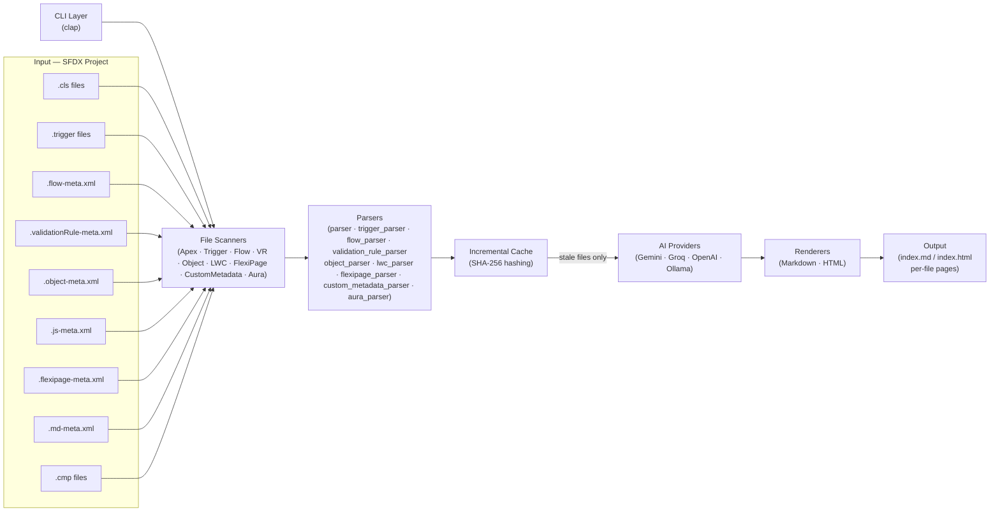
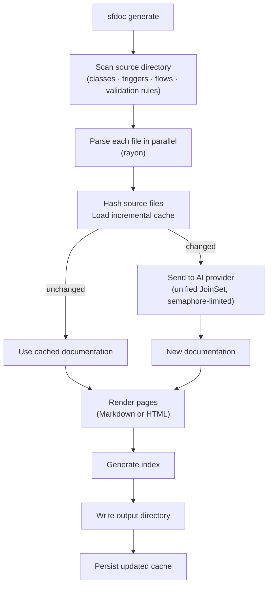

# sfdoc — Salesforce Documentation Generator

`sfdoc` is a Rust CLI tool that turns Salesforce metadata into rich,
AI-generated documentation. It scans your SFDX project, extracts structural
metadata from Apex classes, triggers, Flows, and validation rules, sends that
context to an AI provider, and writes interlinked Markdown or HTML pages that
stay up to date automatically through incremental builds.

---

## Architecture Overview



---

## Project Structure

```
sfdoc/
  Cargo.toml
  src/
    main.rs               # Entry point — CLI dispatch, auth/status commands
    lib.rs                # Module exports
    cli.rs                # clap CLI definitions (Commands, GenerateArgs, UpdateArgs, AuthArgs)
    generate.rs           # Main generate pipeline orchestration
    update.rs             # Single-file update logic (sfdoc update <file>)
    config.rs             # API key storage and resolution (keychain + env var)
    providers.rs          # Provider enum — default models, env vars, base URLs
    scanner.rs            # File discovery (FileScanner trait + 9 scanner implementations)
    parser.rs             # Regex-based Apex class structural parser
    trigger_parser.rs     # Apex trigger structural parser
    flow_parser.rs        # Salesforce Flow XML structural parser (quick-xml)
    validation_rule_parser.rs  # Validation Rule XML structural parser
    object_parser.rs      # Custom Object XML structural parser
    lwc_parser.rs         # LWC @api/slot/component-ref parser (regex-based)
    flexipage_parser.rs   # FlexiPage XML structural parser
    custom_metadata_parser.rs  # Custom Metadata record parser
    aura_parser.rs        # Aura component parser
    apex_common.rs        # Shared Apex helpers: type refs, ApexDoc, @tag extraction
    prompts.rs            # All system prompts + user prompt builders (consolidated)
    doc_client.rs         # Async DocClient trait for AI providers
    gemini.rs             # Google Gemini API client
    openai_compat.rs      # OpenAI-compatible client (Groq, OpenAI, Ollama)
    rate_limit.rs         # Sliding-window RPM limiter
    retry.rs              # Exponential backoff with Retry-After header support
    renderer.rs           # Markdown generation with generic RenderContext<M, D>
    cache.rs              # SHA-256 incremental build cache (.sfdoc-cache.json)
    types.rs              # Shared data structures (metadata, documentation, AllNames)
  tests/
    integration.rs        # E2E tests with httpmock (all metadata types)
    fixtures/             # Sample Apex, Flow, LWC, Trigger, Object, VR, Aura, FlexiPage files
  README.md
  project-plan.md
```

---

## Key Dependencies

| Crate                  | Purpose                                 |
| ---------------------- | --------------------------------------- |
| `clap` (derive)        | CLI argument parsing                    |
| `tokio`                | Async runtime for concurrent API calls  |
| `reqwest`              | HTTP client for AI provider APIs        |
| `serde` / `serde_json` | JSON serialization                      |
| `walkdir`              | Recursive directory traversal           |
| `rayon`                | CPU-parallel file parsing               |
| `indicatif`            | Terminal progress bars                  |
| `sha2`                 | SHA-256 hashing for incremental cache   |
| `anyhow`               | Ergonomic error handling                |
| `async-trait`          | Async trait methods (DocClient)         |
| `regex`                | Apex structural parsing                 |
| `quick-xml`            | XML parsing for Flows, VRs, Objects     |
| `globset`              | Glob pattern matching for name filters  |
| `keyring`              | OS keychain integration                 |
| `rpassword`            | Masked terminal input for API key entry |
| `rand`                 | Random jitter for retry backoff         |

---

## Completed Phases

### Phase 1: Project Scaffolding and CLI ✅

- `Cargo.toml` with all dependencies
- Full module structure established
- `sfdoc generate` subcommand with `--source-dir`, `--output`, `--model`, `--concurrency`, `--verbose`
- API key sourced from environment variable

### Phase 2: File Scanner ✅

- `FileScanner` trait for extensibility across metadata types
- `ApexScanner` implementation using `walkdir`
- Skips `-meta.xml` companion files automatically
- Deterministic sorted output
- `filter_entry` pruning of `.git`, `.sfdx`, `node_modules`, `target`

### Phase 3: Apex Structural Parser ✅

- `OnceLock<Regex>` patterns — compiled once, never in hot loops
- Extracts: class name, access modifier, `abstract`/`virtual`, `extends`, `implements` (including complex generics like `Database.Batchable<SObject>`)
- Extracts method signatures: name, access modifier, return type, parameters, `static` flag
- Extracts properties: name, access modifier, type, `static` flag
- Extracts existing ApexDoc/Javadoc block comments to include in AI context
- Builds a cross-reference list of PascalCase class names (filtering out Apex built-ins)

### Phase 4: AI Client (Gemini) ✅

- Async `reqwest` client against the Gemini `generativelanguage.googleapis.com` API
- `tokio::sync::Semaphore` rate limiting (configurable `--concurrency`)
- Structured prompt: sends full source + extracted metadata + existing ApexDoc comments
- `responseMimeType: application/json` — AI returns JSON directly, no prose scraping
- Parses response into typed `ClassDocumentation` struct

### Phase 5: Markdown Renderer ✅

- One `.md` per class: title, access badges, ToC, description, properties table, method sections with parameter tables, usage examples, See Also cross-links
- `index.md` with alphabetical class listing and one-line summaries
- Cross-linking: scans `relationships` text for known class names, emits relative Markdown links
- `write_output()` creates the output directory and writes all files

### Phase 6: Secure API Key Storage ✅

- `sfdoc auth` subcommand — prompts with masked input via `rpassword`, stores key in OS keychain via `keyring`
- Key is encrypted at rest; never written to disk in plaintext
- Prompts before overwriting an existing key
- `resolve_api_key()` checks environment variable first (CI/CD), then keychain

### Phase 7: Status Command ✅

- `sfdoc status` subcommand — prints version and API key status per provider
- Surfaces whether each key is set via environment variable, keychain, or not configured

### Phase 8: Incremental Builds ✅

- `cache.rs` — SHA-256 hashes each source file before calling the AI
- `.sfdoc-cache.json` persisted in the output directory; maps file paths to `{ hash, model, documentation }`
- Cache is invalidated per file if: source changed, or `--model` changed
- `--force` flag bypasses the cache for a full regeneration
- Separate cache maps for classes and triggers; backward-compatible with old cache files

### Phase 9: Apex Trigger Support ✅

- `TriggerScanner` — discovers `.trigger` files via the same `FileScanner` trait
- `trigger_parser.rs` — parses trigger declaration syntax (`trigger Foo on SObject (events)`)
- `trigger_prompt.rs` — dedicated AI prompt for triggers covering event handlers and handler classes
- Trigger-specific renderer template: event handler table, handler class cross-links, usage notes
- Triggers included in `index.md` / `index.html` alongside classes

### Phase 10: HTML Output Mode ✅

- `--format html` flag on `sfdoc generate`
- `html_renderer.rs` — self-contained static site; all CSS inlined, no external dependencies
- Sidebar navigation listing all classes and triggers
- Works fully offline; suitable for deployment to any static host

### Phase 11: Multi-Provider AI Support ✅

- `providers.rs` — `Provider` enum (Gemini, Groq, OpenAI, Ollama) with per-provider defaults
- `openai_compat.rs` — shared OpenAI-compatible client for Groq, OpenAI, and Ollama
- `DocClient` enum in `main.rs` — static dispatch, zero `dyn` overhead
- `sfdoc auth --provider <name>` — per-provider keychain storage
- Environment variable override per provider (`GEMINI_API_KEY`, `GROQ_API_KEY`, etc.)
- Ollama requires no API key; runs fully locally

### Phase 12: Performance & Efficiency ✅

- **Parallel parsing** — rayon `par_iter()` across class and trigger files
- **`Arc<Vec<_>>` sharing** — task closures receive a pointer clone, not a full `raw_source` clone
- **Unified `JoinSet` work queue** — class and trigger API calls share concurrency slots; results processed as they arrive
- **`Arc<str>` for model string** — cheap pointer copies into task closures
- **`cache.update` takes `&str`** — removes one redundant `String` allocation per file processed
- **Scanner `filter_entry`** — prunes known noise directories early in directory traversal

### Phase 13: Namespace / Folder Grouping in Index ✅

- `folder: String` added to `RenderContext` and `TriggerRenderContext` — derived at build time from the relative path between `--source-dir` and each file's parent directory
- Markdown index groups classes and triggers by folder under `###` subsections, sorted alphabetically; single-folder projects render flat (no extra heading)
- HTML index groups with `<h3>` headings per folder group
- HTML sidebar groups entries by folder with subtle uppercase folder labels; single-folder projects remain flat
- Markdown output defaults to `docs/`, HTML output defaults to `site/` — both formats coexist without overwriting each other; `--output` overrides the default for either format

### Phase 17: Validation Rule Documentation ✅

- `ValidationRuleScanner` — discovers `*.validationRule-meta.xml` under the `objects/` subtree; sorted by path for deterministic output
- `validation_rule_parser.rs` — streaming quick-xml parser that extracts rule name (from filename), object name (from directory structure), active status, description, error condition formula (including multi-line), error display field, and error message; returns proper errors on invalid UTF-8 instead of silently substituting empty strings
- `ValidationRuleMetadata` and `ValidationRuleDocumentation` types in `types.rs`
- `validation_rule_prompt.rs` — dedicated AI prompt asking for: one-sentence summary, when the rule fires (admin-friendly), what data-quality concern it protects, step-by-step formula explanation, edge cases, and referenced fields/objects
- Renderer template per rule: active/inactive badge, formula code block, error message, AI description, edge cases, See Also cross-links
- Per-object grouping in the Markdown and HTML index; inactive rules clearly flagged; output to `validation-rules/` subdirectory
- `AllNames.validation_rule_names` added for full cross-linking across all four asset types
- Cache support: `validation_rule_entries` map with hash + model invalidation, backward-compatible with old cache files

### Phase 18: Custom Object Documentation ✅

- `ObjectScanner` — discovers `*.object-meta.xml` under `objects/` subtrees using `walkdir`; sorted for deterministic output
- `object_parser.rs` — streaming quick-xml parser extracting label, plural label, description, `deploymentStatus`, `enableHistory`, `enableReports` from the object file; also scans a sibling `fields/` directory to parse field files (type, label, description, required flag, lookup reference)
- `ObjectMetadata`, `ObjectFieldMetadata`, `ObjectDocumentation`, `ObjectFieldDocumentation` types in `types.rs`
- `object_prompt.rs` — AI prompt providing full field list with types and any existing descriptions, asking for: label, one-sentence summary, detailed description, per-field descriptions, usage notes, and relationships to Apex/Flows/Triggers
- Renderer: object page with field table (name/type/required/description), usage notes, cross-linked See Also; index grouped by folder
- Cross-linking: `AllNames.object_names` added; object pages link to Apex classes, triggers, flows, validation rules, and other objects
- Cache: `object_entries` map with hash + model invalidation

### Phase 20: Apex Interface Support ✅

- Updated `re_class()` regex to capture both `class` and `interface` declarations
- Added `re_interface_method()` regex (with `(?m)` multiline) to parse interface method declarations lacking access modifiers
- `ClassMetadata.is_interface: bool` field — set automatically by the parser
- `interface_implementors: HashMap<String, Vec<String>>` added to `AllNames` — built in `main.rs` after parsing by iterating class `implements` lists
- Markdown renderer: "interface" badge on interface pages; "Implemented By:" section; separate "## Interfaces" section in index
- HTML renderer: same badge and section logic
- Unit tests: `parses_interface`, `interface_methods_not_empty`, `class_is_not_interface`

### Phase 21: FlexiPages / Lightning Pages ✅

- `FlexiPageScanner` — discovers `*.flexipage-meta.xml` files; sorted by filename
- `flexipage_parser.rs` — streaming quick-xml parser extracting page type, master label, sobject type (for record pages), description, LWC component names (stripping `c__` prefix), and referenced Flow names
- `FlexiPageMetadata`, `FlexiPageDocumentation` types in `types.rs`
- `flexipage_prompt.rs` — AI prompt asking for summary, description, usage context, key component descriptions, and relationships
- Markdown renderer: one page per flexipage with type badge, component list, flow list, AI description; "## Lightning Pages" section in index
- HTML renderer: full HTML page with sidebar "Lightning Pages" section
- Cache: `flexipage_entries` map with hash + model invalidation
- `flexipage_names: Vec<String>` added to `AllNames` for cross-linking

### Phase 22: Custom Metadata Types ✅

- `CustomMetadataScanner` — discovers `customMetadata/*.md-meta.xml` record files; sorted by filename
- `custom_metadata_parser.rs` — streaming quick-xml parser extracting type name and record developer name (from filename), label, and all field values from `<values>` elements
- `CustomMetadataRecord` type in `types.rs`; no AI call — metadata-only listing
- Markdown renderer: one page per custom metadata type listing all records in a table; "## Custom Metadata Types" section in index; output to `custom-metadata/` subdirectory
- HTML renderer: equivalent HTML output with sidebar section
- No cache needed (no AI call)
- `custom_metadata_type_names: Vec<String>` added to `AllNames`

### Phase 23: Aura Components ✅

- `AuraScanner` — discovers `*.cmp` files under `aura/` directories; uses sibling `.js` file as `raw_source` when available; sorted by filename
- `aura_parser.rs` — regex-based parser using `OnceLock<Regex>` patterns; extracts component name, `aura:attribute` elements (name, type, default, description), `aura:handler` events, and `extends` attribute
- `AuraMetadata`, `AuraAttributeMetadata`, `AuraDocumentation`, `AuraAttributeDocumentation` types in `types.rs`
- `aura_prompt.rs` — AI prompt including attribute table and events, asking for component purpose, usage notes, and cross-links
- Markdown renderer: one page per Aura component with attributes table, events, usage notes, See Also; "## Aura Components" section in index; output to `aura/` subdirectory
- HTML renderer: full HTML page with sidebar "Aura" section
- Cache: `aura_entries` map with hash + model invalidation
- `aura_names: Vec<String>` added to `AllNames` for cross-linking

### Phase 19: Lightning Web Components (LWC) ✅

- `LwcScanner` — discovers `*.js-meta.xml` files inside `lwc/` directories; reads sibling `.js` file as `raw_source` for hashing and AI prompting
- `lwc_parser.rs` — regex-based parser using `OnceLock<Regex>` patterns; extracts `@api` properties and methods from JS source; reads sibling HTML template to extract named/anonymous slots and `<c-*>` component references (converted from kebab-case to camelCase)
- `LwcMetadata`, `LwcApiProp`, `LwcDocumentation`, `LwcPropDocumentation` types in `types.rs`
- `lwc_prompt.rs` — AI prompt including Public API table, Slots list, Referenced Components list, and truncated JS source; structured JSON schema for component_name, summary, description, api_props, usage_notes, relationships
- Renderer: LWC page with Public API table (name/kind/description), Slots table, Usage Notes, cross-linked See Also; index section with folder grouping
- HTML renderer: full HTML page for LWC with sidebar including "Components" section; cross-linking to/from Apex classes, triggers, flows, validation rules, and objects
- `AllNames.lwc_names` added for cross-linking across all asset types
- Cache: `lwc_entries` map with hash + model invalidation, backward-compatible

---

## Upcoming Phases

Prioritized into tiers. Tier 1 (CI/CD trust) is prerequisite for running sfdoc unattended in pipelines. Tier 2 (distribution) gets docs where people actually read them. Tier 3 (workflow) adds key missing commands. Tier 4 (polish) is nice-to-have.

---

### Tier 1: CI/CD Trust

#### Phase 29: Atomic Cache Writes

**Goal:** Prevent cache corruption from crashes, power loss, or concurrent runs.

**Design:**
- Write `.sfdoc-cache.json` via temp file + atomic rename (`std::fs::rename`)
- Guarantees either the old or new cache is valid; never a partial write
- Add `.sfdoc-cache.json.tmp` to `.gitignore`

**Impact:** Eliminates the most common cause of unnecessary full regeneration in CI.

---

#### Phase 30: Graceful Shutdown

**Goal:** Save progress when sfdoc is interrupted by Ctrl+C or SIGTERM.

**Design:**
- Register `tokio::signal::ctrl_c()` handler
- On signal: cancel pending tasks, save cache with all completed work, exit cleanly
- Print summary: “Interrupted — N/M files documented, cache saved”

**Impact:** A CI job killed by timeout or OOM doesn't lose all work done so far.

---

#### Phase 31: File-Level Locking

**Goal:** Prevent two sfdoc processes from racing on the same output directory.

**Design:**
- Acquire an advisory lock on `.sfdoc.lock` in the output directory before starting
- If lock is held: print clear error message and exit non-zero
- Release lock on completion or signal

**Impact:** Safe to have dev + CI, or parallel CI jobs, targeting the same repo.

---

#### Phase 32: `--quiet` Mode

**Goal:** Suppress progress bars and informational output for CI environments.

**Design:**
- `--quiet` flag suppresses progress bars and println output
- Errors still go to stderr
- Combine with `--json` (Phase 33) for fully machine-parseable CI output

**Impact:** Clean CI logs; no interleaved progress bar artifacts.

---

#### Phase 33: `--json` Structured Output

**Goal:** Machine-parseable results for CI monitoring and alerting.

**Design:**
- `--json` flag outputs a single JSON object to stdout on completion:
  ```json
  {
    “files_scanned”: 50,
    “files_documented”: 47,
    “files_cached”: 38,
    “files_failed”: 3,
    “failures”: [“OrderService.cls: rate limit exceeded”, ...],
    “duration_secs”: 142,
    “cache_hit_rate”: 0.76
  }
  ```
- Progress bars suppressed when `--json` is active

**Impact:** CI pipelines can parse results, set thresholds, and alert on regressions.

---

#### Phase 34: `--timeout` Flag

**Goal:** Prevent hung API calls from blocking CI pipelines indefinitely.

**Design:**
- `--timeout <seconds>` sets an overall run timeout
- On timeout: save cache (like graceful shutdown), exit with distinct exit code
- Per-file timeout: skip individual files that exceed a threshold and continue

**Impact:** CI jobs have predictable maximum duration.

---

### Tier 2: Distribution

#### Phase 35: `sfdoc publish`

**Goal:** Push generated docs to where people actually read them.

**Design:**
- `sfdoc publish` subcommand with target backends:
  - `--target github-pages` — commit to `gh-pages` branch or configure GitHub Pages
  - `--target confluence` — push pages via Confluence REST API
  - `--target notion` — push pages via Notion API
- Each target is a separate module behind a feature flag
- Reads output directory and publishes all generated docs

**Impact:** Closes the gap between “docs exist locally” and “docs are accessible to the team.”

---

#### Phase 36: GitHub Actions Workflow Template

**Goal:** Zero-config CI setup for the most common use case.

**Design:**
- Ship a `.github/workflows/sfdoc.yml` template in the repo
- Workflow: on push to main → generate docs → publish to GitHub Pages
- Includes API key setup via GitHub Secrets
- Optional: PR comment with diff summary of changed docs

**Impact:** Adoption barrier drops to copying one file.

---

#### Phase 37: Static Site Wrapper

**Goal:** Turn raw markdown output into a browsable documentation site.

**Design:**
- Wrap generated markdown in mdbook or mkdocs-material
- Auto-generate `SUMMARY.md` / `mkdocs.yml` from the index
- Includes: full-text search, navigation sidebar, landing page, mobile-friendly layout
- `sfdoc generate --site` builds the full site in one step

**Impact:** Output looks professional and is usable without a markdown viewer.

---

### Tier 3: Workflow Completeness

#### Phase 38: `sfdoc validate`

**Goal:** Verify all cross-links resolve; catch broken references from renames.

**Design:**
- Scan all generated `.md` files for internal links
- Check that each link target exists on disk
- Report broken links with source file and line
- Exit non-zero if broken links found (CI gate)

**Impact:** Prevents link rot; cheap to run as a CI check.

---

#### Phase 39: `sfdoc diff`

**Goal:** Show what changed since last build without regenerating.

**Design:**
- Compare current source file hashes against cache
- Output list of new, modified, and deleted files
- `--json` support for CI integration

**Impact:** Quick pre-flight check before committing to a full generate run.

---

#### Phase 40: Progress Resumption

**Goal:** Resume interrupted runs from where they left off.

**Design:**
- Cache already tracks completed files; leverage this for automatic resume
- On startup: detect partial run (lock file with metadata), offer to resume
- `--resume` flag for explicit resume behavior

**Impact:** Critical for large orgs where interrupted runs waste API credits.

---

#### Phase 41: `sfdoc impact <Name>`

**Goal:** Show all metadata that references a given class, object, or flow.

**Design:**
- Query the cross-reference index (AllNames + cached relationships)
- Output: list of triggers, flows, VRs, LWC, classes that reference the target
- Supports `--json` for CI integration

**Impact:** High value for architects assessing change impact.

---

### Tier 4: Polish

#### Phase 42: Dependency Graph

**Goal:** Visualize entity relationships as Mermaid/DOT diagrams.

**Design:**
- Build graph from AllNames cross-references
- Output as Mermaid diagram embedded in markdown or standalone `.dot` file
- Optional: per-entity subgraph showing immediate neighbors

---

#### Phase 43: Diff-Aware Summaries

**Goal:** Include git diff context in AI prompts so regenerated docs mention what changed.

**Design:**
- Run `git diff` for each changed file
- Append diff summary to user prompt
- AI generates a “Recent Changes” section in the documentation

---

#### Phase 44: Dead Code Hints

**Goal:** Flag classes/methods with no incoming cross-references.

**Design:**
- After building AllNames, identify entities with zero inbound references
- Add “Potentially Unused” badge to their documentation pages
- Optional: `sfdoc dead-code` command for standalone report

---

#### Phase 45: Confidence / Quality Scores

**Goal:** AI rates documentation completeness; flag low-context methods.

**Design:**
- Add `confidence: f32` field to documentation types
- AI returns a 0-1 score based on how much context it had
- Low-confidence pages flagged in index for human review

---

#### Phase 46: Watch Mode

**Goal:** Auto-rebuild on file save during development.

**Design:**
- `sfdoc watch` monitors source directory via `notify` crate
- Debounce changes, regenerate only affected files
- Uses `sfdoc update` internally for single-file rebuilds

---

#### Phase 47: Dark Mode

**Goal:** CSS dark theme for the HTML output site.

**Design:**
- `prefers-color-scheme: dark` media query
- Toggle button in HTML sidebar
- Persist preference in localStorage

---

### Historical Phase Notes (collapsed)

<details>
<summary>Original design notes for completed phases 15–28 and old phase numbering for 29–40 (click to expand)</summary>

### Phase 21 (completed): FlexiPages / Lightning App and Record Pages

**Goal:** Document what appears on each Lightning page (App, Record, Home) for onboarding and change impact.

**SFDX:** `flexiPages/*.flexipage-meta.xml` (and similar for app/record pages).

**Design:**

- `FlexiPageScanner` — collect `*.flexipage-meta.xml` (and related page types)
- `flexipage_parser.rs` — XML parser that extracts page type, label, and a simplified list of regions/components (e.g. LWC names, Flow names)
- One page per FlexiPage: type, object (if record page), list of components with links to LWC/Flow docs
- Optional AI: short summary of the page’s purpose

**Impact:** Answers “what’s on this app or record page?” and links to LWC and Flows.

---

### Phase 22: Custom Metadata Types (Optional)

**Goal:** List custom metadata types and optionally their records so configuration is documented.

**SFDX:** `customMetadata/*.customMetadata-meta.xml` and object definitions for custom metadata types.

**Design:**

- Scanner/parser for custom metadata type definitions and, if desired, record files
- Index or section listing types and records; optional one-line AI description per type
- Lower priority unless the org relies heavily on custom metadata for config

---

### Phase 23: Aura Components (Optional)

**Goal:** If the codebase still uses Aura, document components alongside LWC.

**SFDX:** `aura/<componentName>/*.cmp`, `*.auradoc`, etc.

**Design:**

- `AuraScanner` and parser for component markup and docs
- Same pattern as LWC: one page per component, public API, cross-links
- Only worth adding if the project has substantial Aura usage

---

### Phase 24: `--type` Filter Flag ✅

- `MetadataType` enum with `clap::ValueEnum` — nine variants: `apex`, `triggers`, `flows`, `validation-rules`, `objects`, `lwc`, `flexipages`, `custom-metadata`, `aura`
- `--type` CLI argument on `GenerateArgs` with `value_delimiter = ','` — accepts comma-separated values or repeated flags (`--type apex --type lwc`)
- `GenerateArgs::type_enabled()` helper: returns `true` when no types are specified (all enabled) or the type is in the selected set
- Scanner dispatch in `main.rs` gated via a `scan()` closure that returns `Vec::new()` for excluded types
- Error message distinguishes "no files found at all" from "no files for the selected types"
- Verbose mode prints the selected type list
- Invalid type names rejected by clap with the full list of valid values
- 6 unit tests covering: no flag (all enabled), single type, comma-separated, hyphenated names, invalid type rejection, repeated flag

---

### Phase 25: `--name-filter` / `--glob` Flag ✅

**Goal:** Narrow docs to files matching a name pattern, useful for documenting a single feature area (e.g. all `Order*` classes).

**Design:**

- `--name-filter <pattern>` accepting shell glob syntax (e.g. `Order*`, `*Service`)
- Applied after scanning, before parsing/AI — skips non-matching files entirely
- Works across all metadata types; matches against the logical name (class name, object name, flow label)
- Can be combined with `--type`

**Impact:** Low implementation cost; dramatically improves UX for partial rebuilds on large orgs.

**Implemented:** `--name-filter` added to `GenerateArgs` using `globset` crate. `GenerateArgs::name_matches()` helper compiles the pattern and matches against filename stems. Filter applied in `main.rs` for all metadata types after scanning. Unit tests in `cli.rs` cover no-filter, prefix glob, suffix glob, and contains glob cases.

---

### Phase 26: Client-Side Search in HTML Site ✅

**Goal:** Make the generated HTML site searchable by class, method, field, and flow name without a backend.

**Design:**

- Inline a minified search library (lunr.js or fuse.js) into the HTML output — no external CDN dependency
- Build a JSON search index at generation time covering: page title, metadata type, short summary, and all method/field/property names
- Search bar in the sidebar; results appear as a filtered list with links
- Index JSON can be inlined in a `<script>` tag or written as a companion `search-index.json`

**Impact:** High visibility improvement; makes large doc sites usable without knowing exact names up front.

**Implemented:** fuse.js (minified, inlined) used as the search engine. `html_renderer.rs` builds a JSON search index at generation time and embeds it in a `<script>` tag in `index.html`. A search input in the sidebar filters the entry list in real time using fuse.js fuzzy matching across title, summary, and method names. No external network requests required.

---

### Phase 27: Tag / Label Filtering ✅

**Goal:** Allow teams to categorise docs with `@tag` annotations and filter the index by tag.

**Design:**

- Recognise `@tag <label>` in ApexDoc block comments during parsing; store as `Vec<String>` on `ClassMetadata`
- HTML index: tag pills on each entry; clicking a tag filters the sidebar to matching entries (JS, no rebuild needed)
- `--tag <label>` CLI flag to generate a filtered doc set containing only tagged files
- Tags propagate to the page header as badges

**Impact:** Enables domain-based organisation (e.g. `@tag billing`, `@tag integration`) on top of the folder structure.

**Implemented:** `extract_tags()` in `apex_common.rs` parses `@tag` annotations from ApexDoc comments. `tags: Vec<String>` added to `ClassMetadata` and `TriggerMetadata`. `GenerateArgs::tag_matches()` applies OR logic with case-insensitive comparison. HTML renderer emits tag badges on class/trigger pages and `data-tags` attributes on sidebar items; clicking a tag pill filters the sidebar via JS. Markdown renderer emits tag badges in the page header. `--tag` filter applied in `main.rs` after parsing, before AI calls.

---

### Phase 28: `sfdoc update <file>`

**Goal:** Re-document a single file without scanning and rebuilding the entire project.

**Design:**

- New `sfdoc update <path>` subcommand
- Reads, parses, and re-sends just the specified file to the AI provider
- Updates the cache entry and rewrites only that file's output page
- Re-generates the index to reflect any changed summary

**Impact:** Fast inner loop for developers actively editing Apex; avoids full rebuild just to refresh one class.

---

### Phase 29: Diff-Aware Summaries

**Goal:** When a file has changed since the last build, tell the AI what changed so the docs reflect the delta explicitly.

**Design:**

- Run `git diff HEAD <file>` (or compare against the cached source snapshot) to produce a unified diff
- Include the diff in the AI prompt alongside the full source: "The following changes were made since the last documentation run: …"
- AI is asked to note breaking changes, new methods, or removed functionality in the description
- Falls back to standard prompt if git is unavailable or file is new

**Impact:** Docs stay meaningful through refactors; surfaces breaking API changes automatically.

---

### Phase 30: Confidence / Quality Scores

**Goal:** Surface where generated documentation is likely to be low-quality so teams can prioritise adding ApexDoc comments.

**Design:**

- AI returns an optional `confidence: "high" | "medium" | "low"` field alongside existing doc fields
- Low confidence triggered by: no existing ApexDoc, very short source, complex generic types with no context
- HTML output: small badge on each page and index entry; low-confidence entries highlighted in the index
- Optional `--min-confidence medium` flag to skip low-confidence files and log them as warnings instead

**Impact:** Helps teams know where to invest in adding comments; avoids surfacing misleading AI-generated docs.

---

### Phase 31: Dependency Graph

**Goal:** Visualise how the org's metadata connects — which classes call which, which flows reference which objects.

**Design:**

- Post-render pass over `AllNames` cross-reference data already collected during the build
- Emit a `dependency-graph.md` with a Mermaid `graph LR` diagram and a `dependency-graph.html` with an interactive D3 or vis.js graph
- Nodes: classes, triggers, flows, objects, LWC; edges: calls, implements, references, handles
- `--graph-depth <n>` flag to limit graph to N hops from a given entry point (pairs well with `--name-filter`)

**Impact:** Immediate visual for onboarding and impact analysis; built entirely from data already gathered.

---

### Phase 32: `sfdoc impact <Name>`

**Goal:** Answer "if I change X, what else breaks?" as a CLI command.

**Design:**

- New `sfdoc impact <Name>` subcommand; reads the existing cache/output — no re-scan needed
- Traverses the cross-reference graph in reverse: finds all pages that link to `<Name>`
- Prints a grouped list: Apex classes, triggers, flows, validation rules, LWC, FlexiPages that reference the target
- `--json` flag for CI/scripting use; exit code 1 if any references found (useful as a pre-merge gate)

**Impact:** Instant impact analysis without opening a sandbox; works offline from the cached doc set.

---

### Phase 33: Dead Code Hints

**Goal:** Flag classes, methods, and flows that have no incoming cross-references anywhere in the documented org.

**Design:**

- Post-render pass: for each documented entity, check whether any other page links to it
- Emit a `dead-code-report.md` / section in the index listing unreferenced entities grouped by type
- Distinguish "no references in this project" from "referenced externally" (managed packages, unscanned dirs) via a `--exclude-from-dead-code <glob>` flag
- Integrate with `sfdoc validate` (Phase 39) to surface both link rot and dead code in one pass

**Impact:** Helps identify technical debt and unused automation; especially useful before major refactors.

---

### Phase 34: Watch Mode

**Goal:** Auto-rebuild docs on file save during active development.

**Design:**

- New `sfdoc watch` subcommand using the `notify` crate for cross-platform filesystem events
- On change: re-runs the pipeline for only the modified file (same logic as Phase 28 `sfdoc update`)
- Debounce rapid saves (300 ms); print a concise rebuild summary to stdout
- Ctrl-C to stop; compatible with `--format html` for live-preview workflows

**Impact:** Eliminates the manual rebuild step during development; natural complement to a local HTTP server serving the `site/` directory.

---

### Phase 35: Deploy to Confluence / Notion

**Goal:** Push generated docs to a team wiki so they live alongside existing documentation.

**Design:**

- New `sfdoc deploy --target confluence` / `--target notion` subcommand
- Confluence: REST API (`/wiki/rest/api/content`) — create or update pages under a configured space key; map sfdoc page hierarchy to Confluence page tree
- Notion: Notion API — create/update database entries or pages under a configured parent page ID
- Auth: `sfdoc auth --provider confluence` stores the token/URL in the keychain (same pattern as AI providers)
- `--dry-run` flag to preview what would be created/updated without writing

**Impact:** Docs reach teams who don't browse static HTML; integrates with existing wiki workflows.

---

### Phase 36: GitHub Pages / Netlify CI Integration

**Goal:** Make it easy to publish docs automatically on every push.

**Design:**

- Ship an example `sfdoc-docs.yml` GitHub Actions workflow that: installs `sfdoc`, runs `sfdoc generate --format html`, and deploys `site/` to GitHub Pages
- Ship a `netlify.toml` example for Netlify continuous deployment
- Add a `sfdoc ci` subcommand that exits non-zero if any files changed and were not regenerated (stale docs gate)
- Document in README with one-click "Deploy to Netlify" badge

**Impact:** Zero-configuration publishing for teams already using GitHub or Netlify; docs stay current automatically.

---

### Phase 37: Dark Mode

**Goal:** Provide a comfortable reading experience in low-light environments.

**Design:**

- CSS `@media (prefers-color-scheme: dark)` block in the inlined stylesheet — no JS required
- Colour palette: dark background (`#1e1e2e`), muted sidebar, high-contrast headings and code blocks
- Optional manual toggle button (moon/sun icon) that writes preference to `localStorage`
- All existing badge colours adjusted for WCAG AA contrast on dark backgrounds

**Impact:** Low implementation effort; significant comfort improvement for engineers who use dark mode system-wide.

---

### Phase 38: `sfdoc diff`

**Goal:** Show which files have changed since the last build without regenerating anything.

**Design:**

- New `sfdoc diff` subcommand; reads `.sfdoc-cache.json` and re-hashes source files in parallel
- Prints a grouped list of: new files (not in cache), changed files (hash mismatch), and deleted files (in cache but gone)
- `--json` flag for scripting; `--exit-code` flag to exit 1 if any changes detected (CI gate)
- Runs in milliseconds since no AI calls are made

**Impact:** Fast "is the doc set stale?" check for CI pipelines; also useful before running a full regeneration to preview scope.

---

### Phase 39: `sfdoc validate`

**Goal:** Verify that all cross-links in the generated output resolve to real pages; catch renamed classes that silently break navigation.

**Design:**

- New `sfdoc validate` subcommand; reads the output directory (Markdown or HTML)
- Parses all internal links and checks that the target file exists
- Reports broken links grouped by source page with the specific anchor/path that failed
- `--strict` flag to exit non-zero on any broken link (suitable as a CI step after `sfdoc generate`)
- Can also validate that every entry in `AllNames` has a corresponding output page

**Impact:** Prevents silent link rot after refactors; pairs with `sfdoc diff` and `sfdoc generate` for a complete CI documentation pipeline.

---

### Phase 40: Progress Resumption

**Goal:** Allow an interrupted `sfdoc generate` run to resume from where it left off rather than starting over.

**Design:**

- Write a `partial` state to the cache file as each file completes (not just at the end of the run)
- On next run without `--force`: files already present in the cache with the correct hash are skipped as today; partially-written output files are detected and re-generated
- Handle SIGINT gracefully: flush cache before exit so completed work is not lost
- `--resume` flag (explicit) vs. automatic resume based on cache state

**Impact:** Critical for large orgs (hundreds of files) where an interrupted run currently wastes all AI credits spent so far.

</details>

---

## Data Flow


