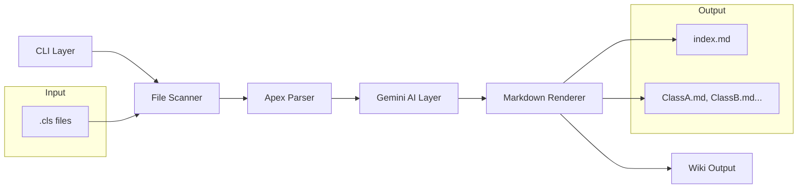
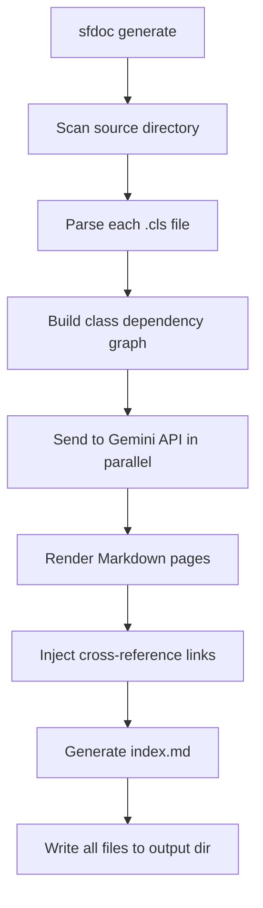

# sfdoc - Apex Documentation Generator

## Architecture Overview



## Project Structure

```
sfdoc/
  Cargo.toml
  src/
    main.rs           # Entry point, CLI setup, pipeline orchestration
    cli.rs            # Clap CLI definitions
    config.rs         # API key storage and resolution via OS keychain
    scanner.rs        # File discovery (walk dirs, find .cls) — FileScanner trait
    parser.rs         # Lightweight Apex structural parser
    gemini.rs         # Gemini API client
    renderer.rs       # Markdown generation + cross-linking
    types.rs          # Shared data structures
    error.rs          # Custom error types (thiserror)
  .cursor/
    rules/
      project-context.mdc   # Always-apply architecture context
      rust-conventions.mdc  # Rust coding standards
  README.md
```

## Key Dependencies

- `clap` (derive) - CLI argument parsing
- `tokio` - async runtime for concurrent API calls
- `reqwest` - HTTP client for Gemini API
- `serde` / `serde_json` - JSON serialization
- `walkdir` - recursive directory traversal
- `indicatif` - terminal progress bars
- `anyhow` - ergonomic error handling
- `thiserror` - typed error enum
- `regex` - Apex structural parsing
- `keyring` - OS keychain integration (macOS Keychain / Linux Secret Service / Windows Credential Manager)
- `rpassword` - masked terminal input for API key entry

---

## Completed Phases

### Phase 1: Project Scaffolding and CLI ✅

- `Cargo.toml` with all dependencies
- Full module structure (`main.rs`, `cli.rs`, `scanner.rs`, `parser.rs`, `gemini.rs`, `renderer.rs`, `types.rs`, `error.rs`)
- `sfdoc generate` subcommand with `--source-dir`, `--output`, `--model`, `--concurrency`, `--verbose`
- API key sourced from `GEMINI_API_KEY` env var

### Phase 2: File Scanner ✅

- `FileScanner` trait for extensibility
- `ApexScanner` implementation using `walkdir`
- Skips `-meta.xml` companion files
- Sorts results for deterministic output
- 3 unit tests

### Phase 3: Apex Structural Parser ✅

- `OnceLock<Regex>` patterns — compiled once, never in hot loops
- Extracts: class name, access modifier, abstract/virtual, extends, implements (including complex generics like `Database.Batchable<SObject>`)
- Extracts method signatures: name, access, return type, params, static flag
- Extracts properties: name, access, type, static flag
- Extracts existing ApexDoc/Javadoc block comments
- Builds a references list of PascalCase class names (filtering out Apex built-ins)
- 9 unit tests

### Phase 4: Gemini API Client ✅

- Async `reqwest` client against `generativelanguage.googleapis.com`
- `gemini-2.0-flash` (default) and `gemini-2.0-pro-exp` model support
- `tokio::sync::Semaphore` rate limiting (configurable `--concurrency`)
- Structured prompt: sends full source + extracted metadata + existing ApexDoc comments
- `responseMimeType: application/json` — Gemini returns JSON directly, no prose scraping
- Parses response into `ClassDocumentation` struct
- 2 unit tests (prompt content verification)

### Phase 5: Markdown Renderer ✅

- One `.md` per class: title, access badges, ToC, description, properties table, method sections with param tables, usage examples, See Also cross-links
- `index.md` with alphabetical class listing and one-line summaries
- Cross-linking: scans `relationships` text for known class names, emits relative Markdown links
- `write_output()` creates the output directory and writes all files
- 7 unit tests

### Phase 6: Memory Bank / Cursor Rules ✅

- `.cursor/rules/project-context.mdc` — always-apply architecture, data flow, module map, key decisions
- `.cursor/rules/rust-conventions.mdc` — error handling, async patterns, regex, naming, testing, dependency table

### Phase 7: Secure API Key Storage ✅

- `sfdoc auth` subcommand — prompts with masked input via `rpassword`, stores key in OS keychain via `keyring` crate
- Key is encrypted at rest; never written to disk in plaintext
- Prompts before overwriting an existing key
- `resolve_api_key()` checks env var first (CI/CD), then keychain

### Phase 8: Status Command ✅

- `sfdoc status` subcommand — prints version and API key source (env var / keychain / not configured)
- Useful as a first step after installation to verify the tool is set up correctly

---

## Upcoming Phases

### Phase 9: Incremental Builds (pending)

Track a `.sfdoc-cache.json` file in the output directory mapping each `.cls` file path to its SHA-256 hash. On subsequent runs, skip classes whose hash hasn't changed. This will make re-runs on large codebases dramatically faster.

Key design points:
- Cache file format: `{ "force-app/.../AccountService.cls": "<sha256>" }`
- Only regenerate if: file hash changed, or `--force` flag passed
- Cache should be invalidated if `--model` changes (different AI output)

### Phase 10: Apex Trigger Support (pending)

Extend the `FileScanner` trait with a second implementation for `.trigger` files. Triggers have a different declaration syntax (`trigger FooTrigger on SObject (before insert, after update) { ... }`). The parser needs a `parse_apex_trigger()` variant and the renderer needs a trigger-specific page template.

### Phase 11: HTML Output Mode (pending)

Add `--format html` to `sfdoc generate`. Render a self-contained static site with:
- Inline CSS (no external CDN dependencies, works offline)
- A sidebar navigation listing all classes
- Syntax-highlighted Apex code blocks

### Phase 12: Namespace/Folder Grouping in Index (pending)

Currently `index.md` lists all classes in a flat alphabetical table. Group by the subfolder structure under `--source-dir` (e.g., classes under `services/`, `controllers/`, `models/`) to make large projects easier to navigate.

### Phase 13: End-to-End Integration Tests (pending)

Add a `tests/` directory with:
- A fixture set of realistic `.cls` files covering edge cases (abstract classes, interfaces, inner classes, generics)
- A mock HTTP server that returns canned Gemini JSON responses
- An integration test that runs the full pipeline end-to-end and asserts on the generated `.md` file content

---

## Data Flow



## Future Extensibility (not in scope, but architected for)

- Incremental builds (track file hashes, skip unchanged) — **Phase 9**
- Additional Salesforce metadata types (Triggers, LWC, Flows, etc.) — **Phase 10**
- Custom templates for output formatting
- Multiple output formats (HTML, Docusaurus, etc.) — **Phase 11**
